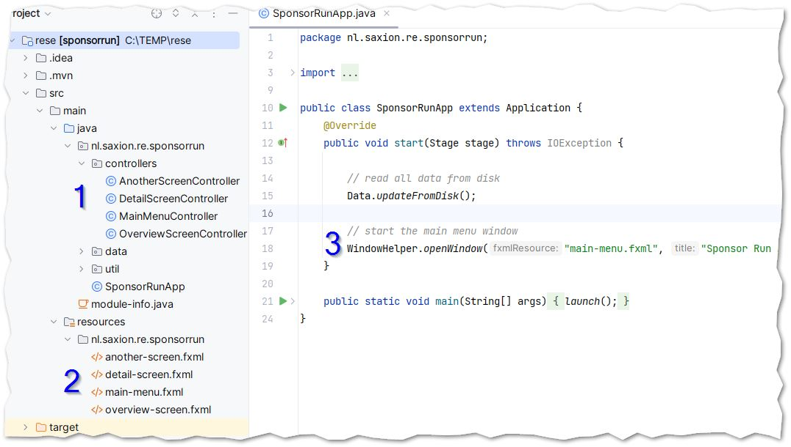
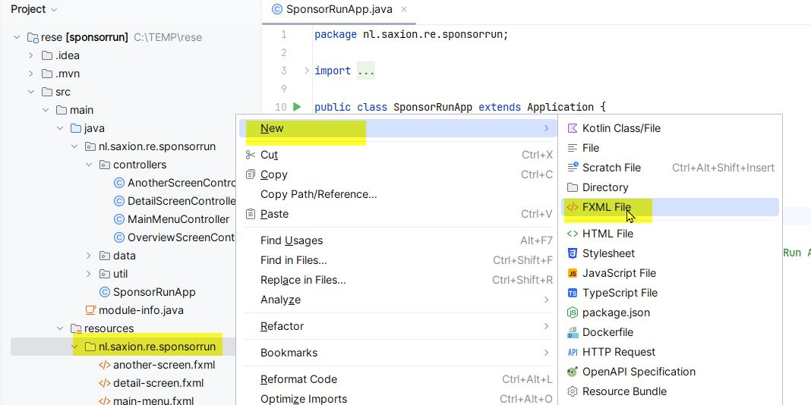
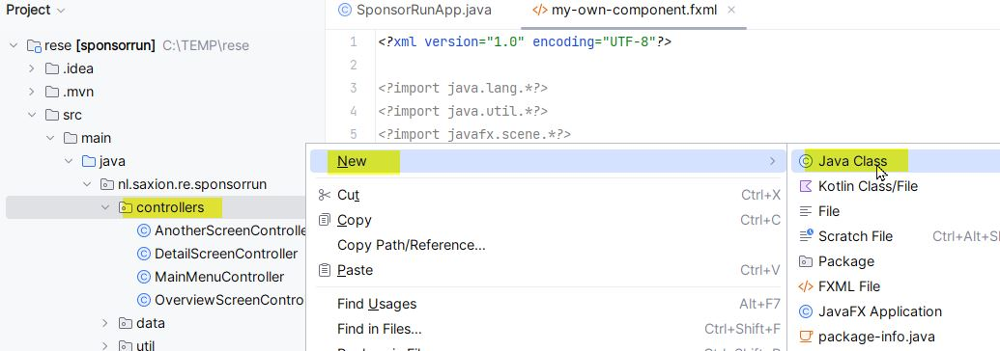
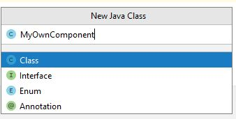
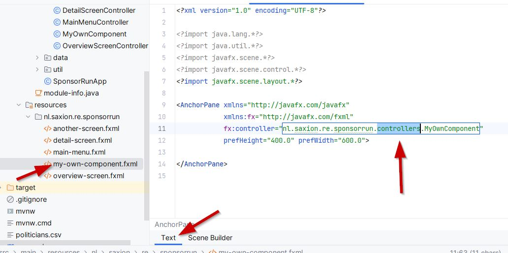
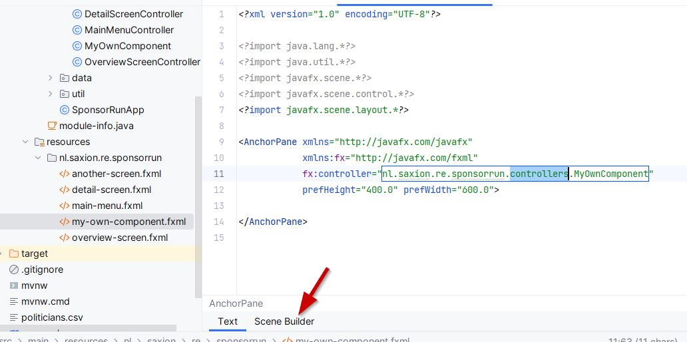
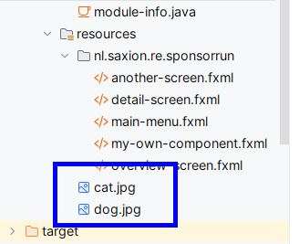
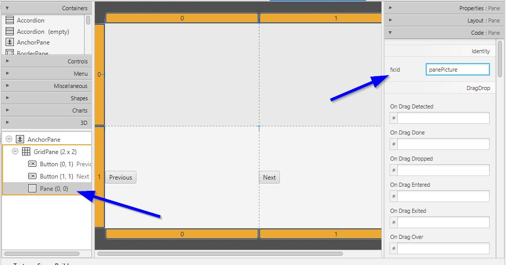
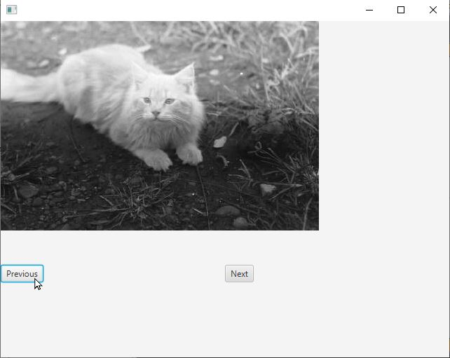

<!-- 
manual changes: add title in title tag  
change css for img, add: 	border: 1px solid Silver;
-->

<!-- in blackboard: 
<p><a href="https://janwillemboer.github.io/Saxion/RE/JavaFX.html" target="_blank" rel="noopener">Open in new tab</a></p>
<p><iframe style="width: 100%; height: 12000px;" src="https://janwillemboer.github.io/Saxion/RE/JavaFX.html"></iframe></p>
-->

# Tutorial: extending the JavaFX template for Requirements Engineering

## Initializing the project

Download and extract the template project and open it in IntelliJ. 

After some time, the project will be ready. You can test the application by starting it from the `SponsorRunApp` class.

The project looks like this:



The Controllers (1) are the code that make all screens work. The fxml files (2) are the Views and contain the user interface definitions (buttons, lists, etc). The two types of files belong together: you'll see a `detail-screen.fxml`, and also a `DetailScreenController`. 

The application first loads data from disk on line 15. This is some sample data from a CSV with Dutch politicians and their political parties. 

On line 18 (3) the "main-menu" view is opened. This will load the UI from `main-menu.fxml` and the code that defines the behavior of the component from the `MainMenuController`. 

## Adding your own UI components

Let's add our own component. Right-click the package name in the `resources` directory and select New &gt; FXML File.



Give it the name "my-own-component":


Now also create the Controller file. Right-click the package name in the `java` directory and select New &gt; Java Class.



Give it the name `MyOwnComponent`.  
(*NOTE: If you gave your `fxml` file another name, then the controller should have the name that you can find in the `fx:controller` attribute in the `fxml`.*)



We don't need the Controller for now, so head back to our `fxml` file: double-click the file `my-own-component.fxml`. When you open an `fxml` file, it opens either as XML or in the UI designer. We should first have the XML view, because we need to correct the controller name there. Click the "Text" tab if it is not visible, and add "controllers" to the namespace in the MyOwnComponent reference:



Now press the "Scene Builder" tab at the bottom to go to the UI designer. 



Clicking the tab will open the Scene Builder.  

*NOTE: You may have to install two additional libraries when you try to use the scene builder for the first time. Click the message on top of the window (twice, for two libraries), and have some patience.*


Now we will add two buttons and a canvas to our component (also see the video below):

- drag a GridPane onto the component. 
- select "Layout" on the right and make all Anchor constraints `0` (or `5` if you like some margin).
- delete the first row
- drag two buttons from the Controls on the left onto the grid, one in the bottom left cell and the other in the bottom right cell.
- select "Properties" on the right and change the text on the buttons to "Previous" and "Next".
- from "Containers" on the left, drag a Pane to the top left cell of the grid.
- on the right, on "Layout" make the Pane span two columns (set `Column Span` to `2`). 

<video controls width="1000">
    <source src="javafx/8-add-controls.mp4" type="video/mp4">
</video>

## Show our screen

Now we want our new screen to be shown at some point to test it. Let's hijack the sample application to show our own screen. 

Open the `SponsorRunApp` class again and change the line where it opens `main-menu.fxml` to `my-own-component.fxml`.

Now instead of showing the menu, the application will now load our new component when the user clicks the button.

Start the application to test your sensational new screen.

## Add functionality

We want our new screen to actually do something whenever the buttons are pressed. If the left button is pressed, we want to show a picture of a cat from 1947 and if the right button is pressed a dog from 1965. Because why not.

Save the images of a [cat](https://service.archief.nl/gaf/api/file/v1/img/2779f6af-a4c4-4774-aab3-f3f615696905?h=300) and a [dog](https://service.archief.nl/gaf/api/file/v1/img/80c487af-3093-4b9d-a25f-676f46e322d8?h=300) (click on the words to download the images) into the resources directory. Rename the files to `cat.jpg` and `dog.jpg`.



The functionality of a screen is programmed into the Controller class, in our case the `MyOwnComponent` class. 

First, we need to make sure we can add an image to the `Pane` we added in the first row. For this, the `Pane` should have a name, so we can reference it from code. Open the `my-own-component.fxml` file in the Scene Builder, click on the `Pane` in the tree on the left, or on the `Pane` itself. On the right, in "Code" on the `fx:id` property, give the panel the id `panePicture`.



Open the `MyOwnComponent` class and add a new field of type `Pane` with the id you just added to the pane.  
The `Pane` class should be imported from the `javafx.scene.layout` package. The field should be "annotated" with the `@FXML` annotation from the `javafx.fxml` package:

```java
@FXML
private Pane panePicture;
```

Now also add a method we can call whenever the Previous button is pressed. This method should also be annotated in the same way:

```java
@FXML
private void onPreviousButtonPressed() {

}
```

In the method we can add a picture to the `Pane`, like this:

```java
// 1947 cat from the dutch national archive
String path = "/cat.jpg";

// remove previous pictures (if any)
panePicture.getChildren().clear();

// add the picture from the url
panePicture.getChildren().add(new ImageView(path));
```

The `MyOwnComponent` class should now look like this:


Now we should connect the Previous button to the method we just created. Open the Scene Builder again, select the button and in "Code", find the "On Action" property. In its dropdown you can select the method we created:


Run the application. When you now click the "Previous" button, the picture of the ancient cat appears: 



# Do it yourself

## Assignment 1: the "Next" button
You can now go ahead and implement the "Next" button yourself, to show the 
[dog](https://service.archief.nl/gaf/api/file/v1/img/80c487af-3093-4b9d-a25f-676f46e322d8?h=300).


## Assignment 2: getting and setting text in controls

- Add a new screen with its own `fxml` and controller class. 
- Add a label, a textfield and a button. 
- Give the label the id `labelGreeting` by setting the `fx:id`
- Give the textfield the id `textName`
- Add code to the controller to get the name from the user from `textName` (HINT: use `getText()` on the textField) and display a greeting in the label. (HINT: use `setText()` on the label)
- Show the new screen when starting the application


## Assignment 3: Show a random image, based on a query

Create a screen in which the user can enter a text. When a button is pressed, the application shows a random picture based on the text. You can use the Unsplash API for this by using this url: [https://source.unsplash.com/random/300x200/?dog](https://source.unsplash.com/random/300x200/?dog)  
Everything after the question mark is the search query. In this example it will show a random image of a dog. You can copy the code for showing the image of the cat, and use the unsplash url instead of the /cat.jpg path.

# Closing remarks

When you completed this tutorial, you know some of the very basics of JavaFX. But it's a large framework, capable of doing many nice things. There are lots of tutorials and references online, for example [this playlist on YouTube](https://www.youtube.com/playlist?list=PL6gx4Cwl9DGBzfXLWLSYVy8EbTdpGbUIG).


# Attribution

This tutorial is [CC BY-NC-SA licensed](https://creativecommons.org/licenses/by-nc-sa/4.0/). This means that when sharing it: BY – credit must be given to the creator, NC – only noncommercial uses of the work are permitted and, SA – adaptations must be shared under the same terms.  


Author: [Jan Willem B](mailto:j.w.boer@saxion.nl) @ [Saxion University of Applied Sciences](https://www.saxion.edu).   
Dog and cat from [Dutch National Archives](https://www.nationaalarchief.nl/onderzoeken/zoeken?activeTab=photos&rm=gallery).  
Random image search by [unsplash](https://unsplash.com/)   
Last updated: 2024-02-02.  


